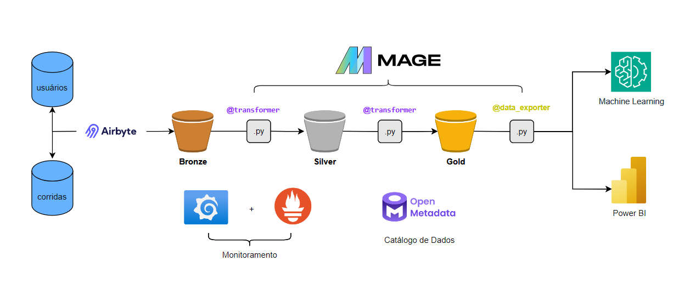

# Arquitetura da Plataforma de Dados para eventos

Sabendo que hoje temos serviços de aplicativos que conectam motoristas e pessoas que precisam de carona, possibilitando a criação de uma alternativa ao táxi. Imagine que temos as seguintes fontes de dados:

- **Usuários:** Contempla clientes e motoristas identificados por uma coluna tipo.
- **Corridas:** Referência cliente e motorista, também contém informações sobre a viagem realizada.

Vamos criar um desenho de solução que utiliza CDC para coletar informações de ambas as fontes e une os dados e armazena em um Data Lake.
Lembrando que não podemos ter corridas sem usuários cadastrados, então não pode haver assincronia entre os dados.

## Desenho da Arquitetura

 
 
## Ferramentas Utilizadas

Imaginando que temos duas fontes de dados em ambientes relacionais (MySQL por exemplo), vamos utilizar o Airbyte para facilitar a conectividade entre as fontes de dados e o destino, capturando os dados e suas atualizações (full load ou streaming). O destino será um bucket da camada Bronze (MinIO), armazenando os dados brutos.

No bucket da camada Silver, os dados são processados da camada anterior dentro de um script python (pyspark) e tratados (transformer) eliminando qualquer duplicidade ou valor nulo que não são utilizados na análise final dos dados, garantido que não tenha principalmente corridas sem usuários cadastrados. Nesta etapa os dados são particionados por ano, mês e dia, estão formato parquet e utilizando o upstream do Delta Lake. Todo esse processo está em um orquestrador (Mage).

No bucket da camada Gold, os dados são capturados na camada anterior, tratados (transformer), prontos para consumo de relatórios, dashboards ou análises específicas. Aqui podemos aplicar agregações e cálculos mais complexos. Exemplo: Métricas como total de corridas por motorista, distância percorrida por mês, etc.

Por fim, os dados da camada Gold podem ser enviados (data_exporter) para algumas fontes de análise (Power BI) e/ou estudos dados (ML)

Todo processo é monitorado em tempo real no grafana (Utilizando o Prometheus como base). Para catálogo de dados podemos utilizar o Open Metadata.

Algumas informações sobre as ferramentas open-source:
- **Airbyte:** Integração de dados fornecendo extração e replicação de dados em tempo real. Ele se conecta a uma ampla gama de fontes de dados, tanto relacionais quanto APIs e sistemas baseados em arquivos.
- **Mage:** Plataforma de orquestração de dados que facilita a criação e o gerenciamento de pipelines de dados em tempo real ou em batch.
- **MinIO:** Armazenamento de objetos compatível com a API do Amazon S3 (Inclusive utiliza o boto3).
- **Grafana:** Oferece monitoramento em tempo real da pipeline de dados e alertas para problemas de desempenho.
- **Open metadata:** Governança de dados, que oferece um catálogo centralizado para rastreamento de metadados, linhagem de dados e qualidade dos dados.

