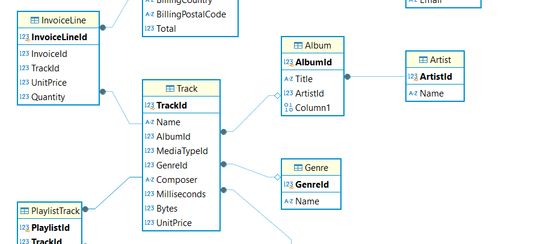
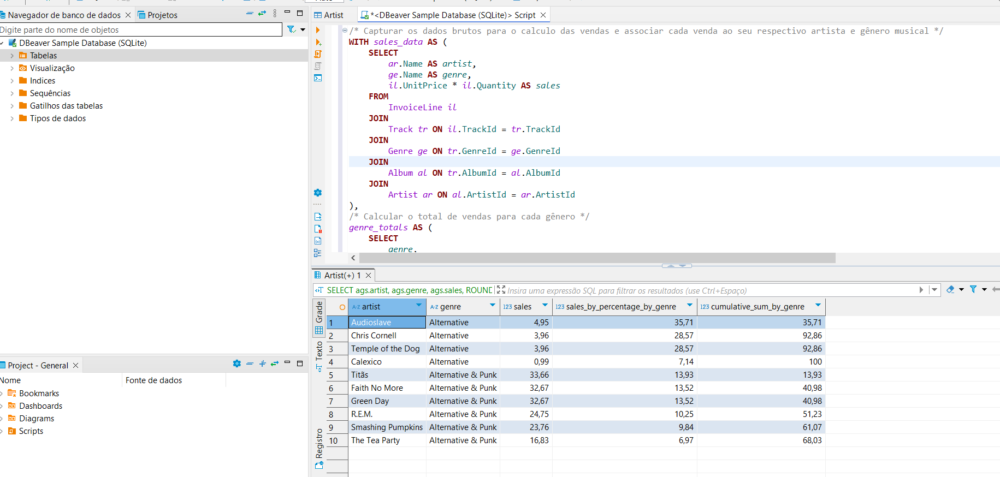

# Análises com SQL

Para esse desafio será usado o DBeaver, para obter os dados e escrever consultas SQL:

1. Acesse o link https://dbeaver.io/download/, baixe e instale a versão compatível com seu sistema operacional.
2. Inicie o programa e aceite a sugestão de iniciar o 'Sample Database’, se preciso mais informações acesse https://dbeaver.com/docs/wiki/Sample-Database/. 
3. Clique duas vezes na pasta 'Tables' e depois em 'ER Diagram' para acessar o schema do banco. Acesse https://dbeaver.com/docs/wiki/Database-Structure-Diagrams/ para entender como utilizar e ler o ERD (Entity Relation Diagram) no DBeaver. 

Os dados do Sample Database do DBeaver contém informações de músicas vendidas em uma loja. Com base nesses dados, um analista estruturou em Excel a seguinte análise:

| artist | genre | sales | sales_percentage_by_genre | cumulative_sum_by_genre |
| --- | --- | --- | --- | --- |
| Audioslave | Alternative | 4.95 | 35.7% | 35.7% |
| Chris Cornell | Alternative | 3.96 | 28.6% | 64.3% |
| Temple of the Dog | Alternative | 3.96 | 28.6% | 92.9% |
| Calexico | Alternative | 0.99 | 7.1% | 100.0% |
| Titãs | Alternative & Punk | 33.66 | 13.9% | 13.9% |
| Faith No More | Alternative & Punk | 32.67 | 13.5% | 27.5% |
| Green Day | Alternative & Punk | 32.67 | 13.5% | 41.0% |
| R.E.M. | Alternative & Punk | 24.75 | 10.2% | 51.2% |
| Smashing Pumpkins | Alternative & Punk | 23.76 | 9.8% | 61.1% |
| The Tea Party | Alternative & Punk | 16.83 | 7.0% | 68.0% |
| … | … | … | … | … |

## Diagrama ER das tabelas envolvidas:

Descrição das colunas da análise, a origem dos dados é mostrada na notação **(Coluna | Tabela de origem)** :

- **artist:** contém o nome dos artistas autores das músicas vendidas / faturadas (Name | Artist)
- **genre:** contém o gênero das músicas (Name | Genre)
- **sales:** valor do faturamento referente as músicas vendidas daquele artista, naquele gênero (*UnitPrice|InvoiceLine* * *Quantity|InvoiceLine*)
- **sales_by_percentage_by_genre:** Essa coluna divide o valor de vendas de um determinado artista e gênero pelo total de vendas no gênero. Ex: No gênero 'Alternative' o artista 'audioslave' teve 4.95 de vendas, representando 35.7% do total de vendas desse gênero
- **cumulative_sum_by_genre:** contém a soma acumulada dos valores na coluna *sales_by_percentage_by_genre*. A soma cumulativa resulta em 100% para a última música listada de cada gênero. Note que os valor da soma é igual ao valor da linha atual somado com as músicas listadas anteriormente para um determinado gênero

A ordenação dos dados também é importante, a tabela desenvolvida pelo analista está ordenada de forma ascendente pelo nome do gênero e de forma descendente pela coluna *sales_percentage_by_genre.*

O mesmo artista pode ter músicas com gêneros diferentes

## Objetivo:

Criar uma consulta em SQL que replique o resultado da tabela acima, ou seja, o resultado das 10 primeira linhas da consulta devem resultar na mesma tabela vista no exemplo.

## Resultado:
Código completo: [Sample_Database.sql](sql/code/Sample_Database.sql)

